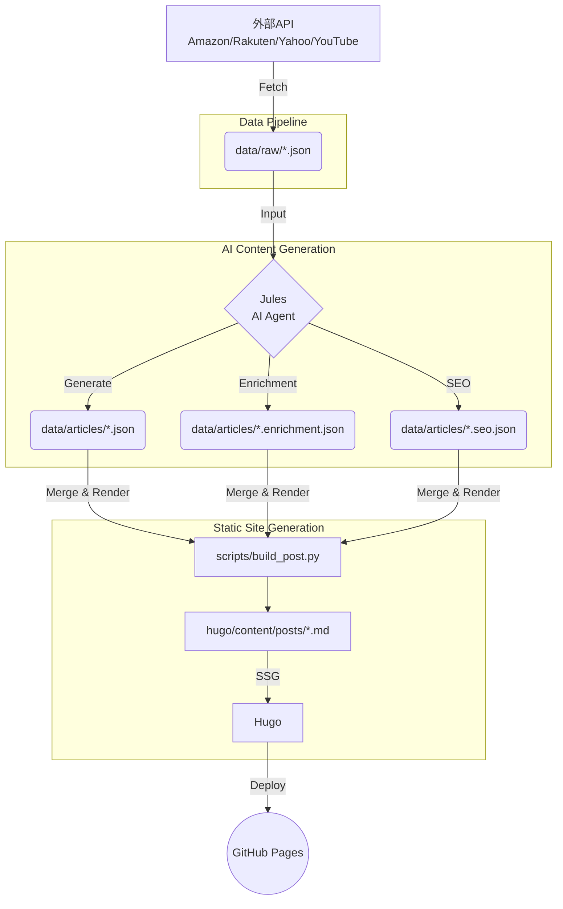

# omochairo / amazon (おもちゃいろ 比較ナビ)

[おもちゃいろ 比較ナビ](https://navi.omcha.jp) は、omochairo Lab が運営する知育玩具比較サイトのリポジトリです。
市場データ（Amazon・楽天・Yahoo!ショッピング等）を自動収集し、AI記事生成エージェント（Jules）が評価・レビューを生成、Hugo を用いて静的サイトとしてビルド・公開する自動化パイプラインを備えています。

---

## 🏗️ アーキテクチャ

システムの全体像は以下の通りです。
データ収集から AI による記事執筆、静的サイト生成、そして GitHub Pages への自動デプロイまでが GitHub Actions を用いて連携しています。



---

## 🚀 セットアップ手順

ローカル環境でプロジェクトを動かすための手順です。

### 前提条件
- Python 3.10+
- Hugo Extended v0.120+
- Git

### インストール & 起動

```bash
# 1. リポジトリのクローン
git clone --recurse-submodules https://github.com/omochairo/amazon.git
cd amazon-clone

# 2. Python 依存関係のインストール
pip install -r requirements.txt

# 3. 記事のビルド（必要に応じて）
python scripts/build_post.py

# 4. Hugo ローカルサーバーの起動
cd hugo
hugo server -D
```

ブラウザで `http://localhost:1313/` にアクセスしてプレビューを確認します。

---

## ⚙️ 主要 Workflow (GitHub Actions)

本リポジトリは自動化を前提としており、以下の主要なワークフローが稼働しています。

- **`01-fetch-products.yml`**
  - 市場データの定期取得。`scripts/fetch_*.py` 群を実行し、Amazon/楽天/Yahoo等の最新データ・レビュー・トレンドを `data/raw/` に JSON 形式で保存します。
- **`02-publish.yml`**
  - 記事データのビルドおよびサイトの公開。`build_post.py` を用いて JSON から Markdown を生成し、Hugo でビルド後、GitHub Pages へデプロイします。
- **`03-invoke-jules.yml`**
  - Jules（AIエージェント）の起動。新しい未処理データがある場合に AI に記事執筆を依頼します。
- **`04-validate-article-pr.yml`**
  - Jules が作成した Pull Request の品質ゲート検証。`scripts/quality_gate.py` などを用いて出力された JSON の構成・品質（SEO要件など）を自動チェックします。
- **`05-jules-auto-merge.yml`**
  - 品質ゲートを通過した Jules の PR を自動マージします。

---

## 🔑 環境変数 / Secrets

GitHub Actions およびローカルでのデータ取得に以下の環境変数（APIキー等）を使用します。
*(※ 具体的な値は GitHub Secrets で管理しています。)*

| 変数名 | 用途 |
|---|---|
| `AMAZON_PAAPI_*` | Amazon Product Advertising API 認証情報 |
| `RAKUTEN_APP_ID` | 楽天 API アプリケーションID |
| `YAHOO_CLIENT_ID` | Yahoo!ショッピング API クライアントID |
| `YOUTUBE_API_KEY` | YouTube Data API キー |
| `JULES_API_KEY` | Jules (LLMエージェント) 動作用APIキー |

---

## 🤝 コントリビューションガイド

### 人間の運用
- 基本的に `scripts/` 配下の Python スクリプトの保守や、Hugo テーマ / アーキテクチャの変更を担当します。
- 環境構築後、専用のフィーチャーブランチを作成して PR を出してください。

### Jules (AI) の運用
- 記事の生成や小〜中規模のタスク（CSS修正など）は Jules が担当します。
- AI エージェントの挙動ルール、出力スキーマ、文章のトンマナ（女性誌調）、SEO戦略等の詳細は [AGENTS.md](./AGENTS.md)（および `instructions.md`）を参照してください。

### TODO 管理のポリシー
- **TODO リストはソースコード内やローカルファイル（メモリ内）に持たない** ことを原則とします。
- 課題やタスクは全て **GitHub Issues** で一元管理します。
- Jules 起動時は `SessionStart hook` 等を利用して Issue ベースで優先度を判断し、作業を進めます。

---
<small>© omochairo Lab. All rights reserved.</small>
